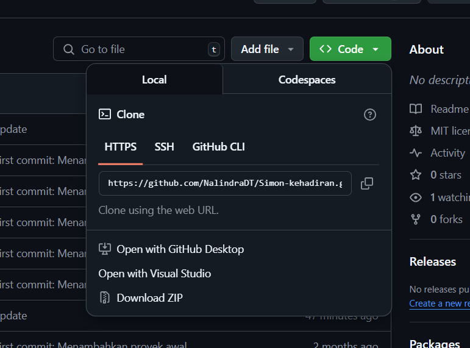

# SISTEM MONITORING KEHADIRAN MAHASISWA (BACKEND : CI4)
<pre>
Nama    : Nalindra Driyawan Thahai
Kelas   : TI 2C
NPM     : 230202070
</pre>

## Apa itu Code Igniter? (CI4)

**Codeigniter** merupakan sebuah framemwork yang dimiliki bahasa php. Framework ini biasanya digunakan untuk pengembangan suatu web karena sifatnya yang cepat dan efisien. Framework ini menggunakan pola MVC (Model-View-Controller) untuk memisahkan logika aplikasi, tampilan, dan data.

<p align="justify">Projek ini dibuat untuk memudahkan Mahasiwa dan dosen untuk melihat atau mengelola sebuah data kehadiran. Dalam projek ini Codeigniter akan digunakan oleh backend sebagai alat untuk membuat rest API yang nanti nya akan di gunakan oleh frontend (laravel)</p>

## Teknologi yang Digunakan

- **Backend**: [CodeIgniter 4](https://codeigniter.com/)
- **Bahasa Pemrograman**: PHP
- **Manajemen Dependensi**: Composer
- **Testing**: Postman

## Fitur - fitur yang disediakan
- **Login**: User dapat login menggunakan username dan password yang disediakan
- **Pengelolaan data** : User - user tertentu dapat melihat, menambahkan, mengedit data.
- **Pencarian data**: user dapat mencari data sesuai dengan yang ada dalam table


## Link database github :
```
https://github.com/JiRizkyCahyusna/DBE_Simon
```
## Langkah langkah penggunaan

### 1. Buka repo backend berikut [Simon-kehadiran](https://github.com/NalindraDT/Simon-kehadiran)

### 2. Klik tombol hijau yang bertulisan <> code, lalu klik tombol salain untuk melakukan cloning


### 3. selanjutnya masuk ke terminal lalu pergi ke path laragon
contoh path:
```
C:\ cd laragon\www\Backend
```
### 4. Masukan perintah berikut untuk melakukan cloning
```
git clone https://github.com/NalindraDT/Simon-kehadiran.git

```
### 5. Selanjutnya buka folder tersebut dalam bentuk visual code, dengan masuk path folder tersebut lalu ketik code .

```
C:\laragon\www\Backend cd Simon-kehadiran
```

```
code .
```
### 6. Setelah terbuka maka selanjutnya pergi ke terminal dalam vs code (bisa mengggunkan ctrl + shift + ` )

### 7.  Lakukan penginstallan composer dengan menggunakan syntax ini
```
C:\laragon\www\Backend\Simon-kehadiran composer install
```
### 8. Jika penginstallan composer gagal maka pindah ke terminal laragon lalu lakukan hal yang sama

```
C:\laragon\www\Backend\Simon-kehadiran composer install
```

### 9. Jika masih muncul error maka kemungkinan berada di versi nya, untuk itu ketik syntax
```
composer update
```
### 10. Jika sudah, maka pergi ke file env lalu duplikat file tersebut, dengan tujuan karena env nantinya kan diubah ubah, maka sebaiknya buat duplikat sebagai backup

### 11. Ubah nama file env yang digunakan menjadi .env

### 12. Selanjutnya hilangkan comment pada penghubung database lalu isi sesuai kebutuhan
```
database.default.hostname = localhost
database.default.database = {nama database}
database.default.username = root
database.default.password = 
database.default.DBDriver = MySQLi
database.default.DBPrefix =
database.default.port = 3306
```

### 13. Setelah selesai semua maka lanjutkan dengan pengetesan pada aplikasi postman, gunakan endpoint - endpoint. berikut endpoin yang bisa digunakan

#### A. Mahasiswa
- GET mahasiswa     : http://localhost:8080/mahasiswa
- POST mahasiswa    : http://localhost:8080/mahasiswa
- PUT mahasiswa     : http://localhost:8080/mahasiswa/{npm}
- DELETE mahasiswa  : http://localhost:8080/mahasiswa/{npm}

#### B. Dosen
- GET dosen        : http://localhost:8080/dosen
- POST dosen       : http://localhost:8080/dosen
- PUT dosen        : http://localhost:8080/dosen/{nidn}
- DELETE dosen     : http://localhost:8080/dosen/{nidn}

#### C. Kelas
- GET kelas       : http://localhost:8080/kelas
- POST kelas      : http://localhost:8080/kelas
- PUT kelas       : http://localhost:8080/kelas/{id_kelas}
- DELETE kelas    : http://localhost:8080/kelas/{id_kelas}

#### D. Matkul
- GET matkul     : http://localhost:8080/matkul
- POST matkul    : http://localhost:8080/matkul
- PUT matkul     : http://localhost:8080/matkul/{kode_matkul}
- DELETE matkul  : http://localhost:8080/matkul/{kode_matkul}

#### E. User
- GET user      : http://localhost:8080/user
- POST user     : http://localhost:8080/user
- PUT user      : http://localhost:8080/user/{id_user}
- DELETE user   : http://localhost:8080/user/{id_user}

#### F. Kehadiran
- GET kehadiran : http://localhost:8080/kehadiran1
- POST kehadiran: http://localhost:8080/kehadiran1
- PUT kehadiran : http://localhost:8080/kehadiran1/{id_kehadiran}
- DELETE kehadiran : http://localhost:8080/kehadiran1/{id_kehadiran}


#### G. Cetak
- GET cetak : http://localhost:8080/kehadiran1/cetak
(endpoint cetak hanya dapat berjalan di browser)

### PENTING !!!
Jika saat mengpost muncul error, maka pilih lah bagian body lalu raw, lalu masukan secara manual seperti berikut
```
{
        "kode_kelas": "KLS01",
        "nama_kelas": "A"
    }
```
Error ini terjadi karena hasil berbentuk JSON, hal ini juga berlaku untuk PUT
